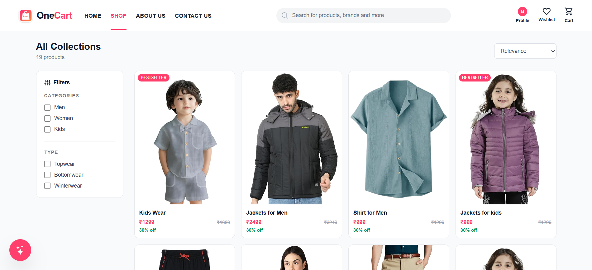
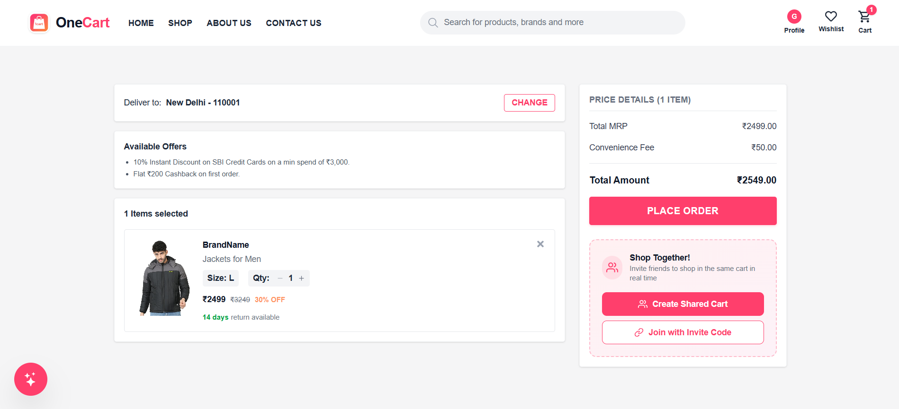
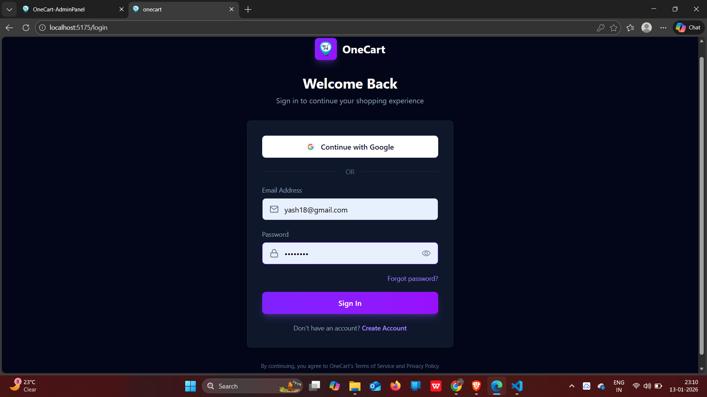
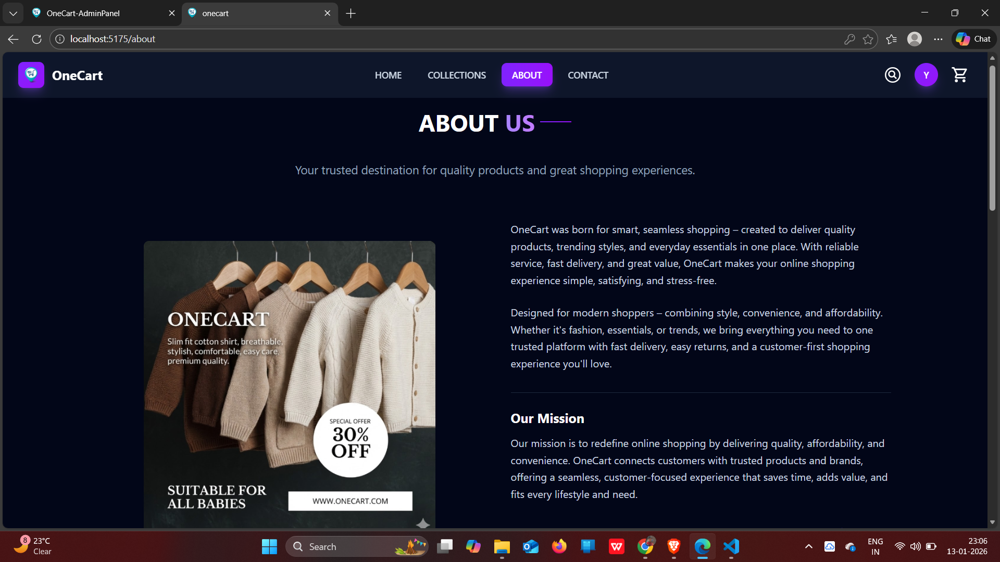
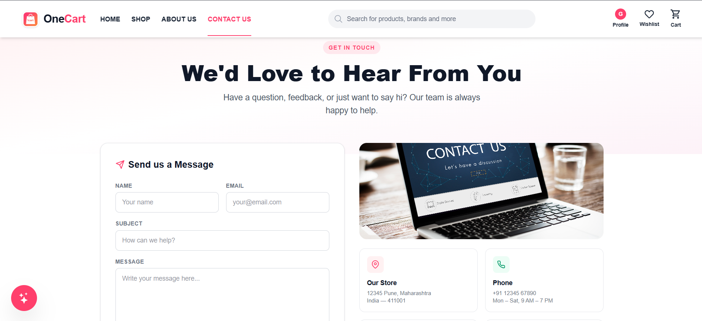
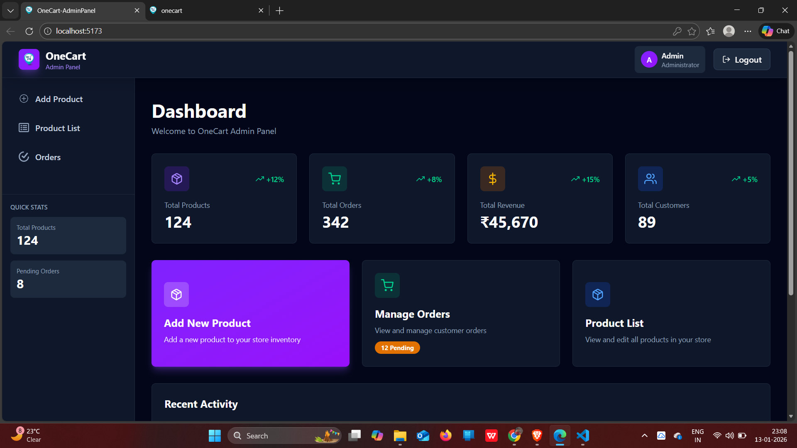

# 🛒OneCart : E-Commerce Website (MERN)

## 📂 Project Structure
- **Frontend** – User shopping website
- **Admin** – Admin dashboard
- **Backend** – REST API & database

## 🧑‍💻 Tech Stack
- React
- Node.js
- Express.js
- MongoDB
- Razorpay 
- JWT Authentication

## ✨ Features
- User & Admin Authentication
- Product Management
- Cart & Checkout
- Online Payments
- Order Management

## ▶️ How to Run Locally

### Backend
cd backend
npm install
npm run dev

### Frontend
cd frontend
npm install
npm run dev

### Admin
cd admin
npm install
npm start

## 📸 Project Screenshots
> ⚠️ Screenshots are from local development environment

### 🏠 User Website

#### Home Page

#### Collections Page

#### Cart Page

#### Login Page

#### About Page

#### Contact Page

---

### 🧑‍💼 Admin Panel

#### Admin Dashboard

